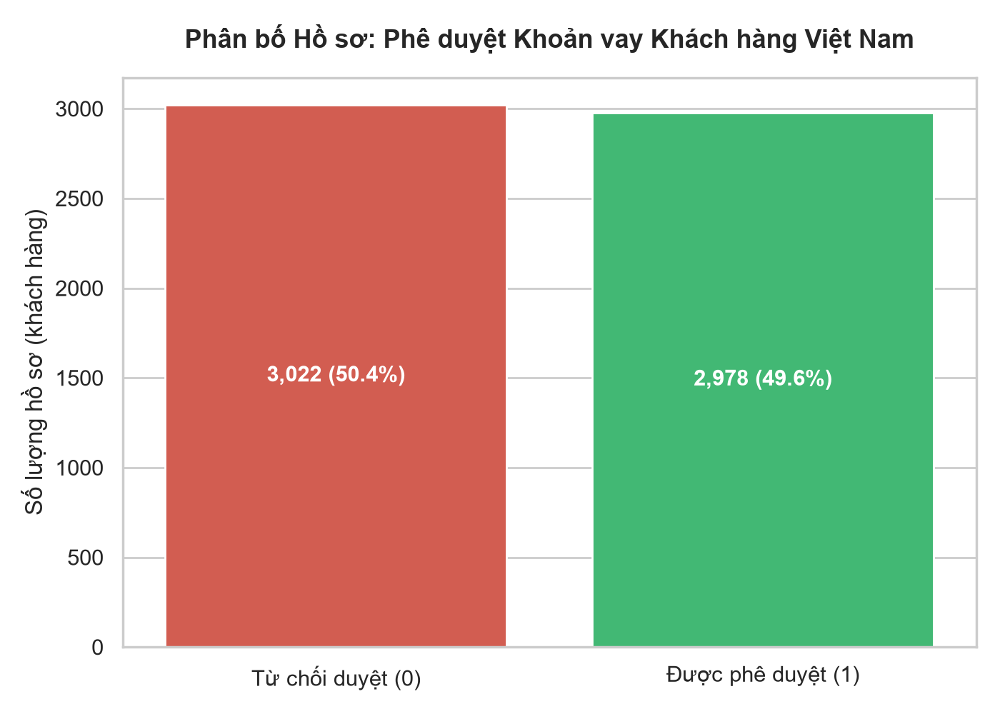
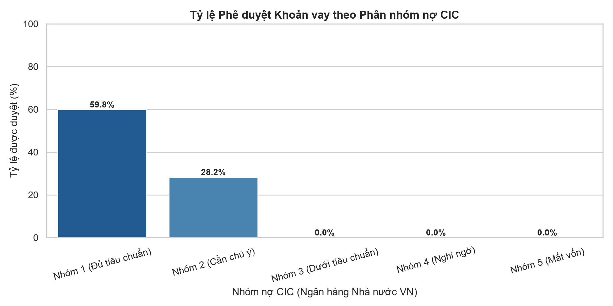
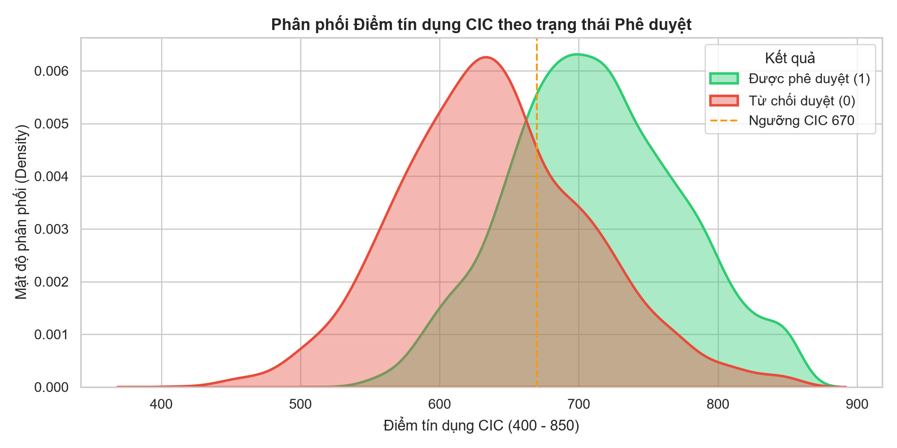
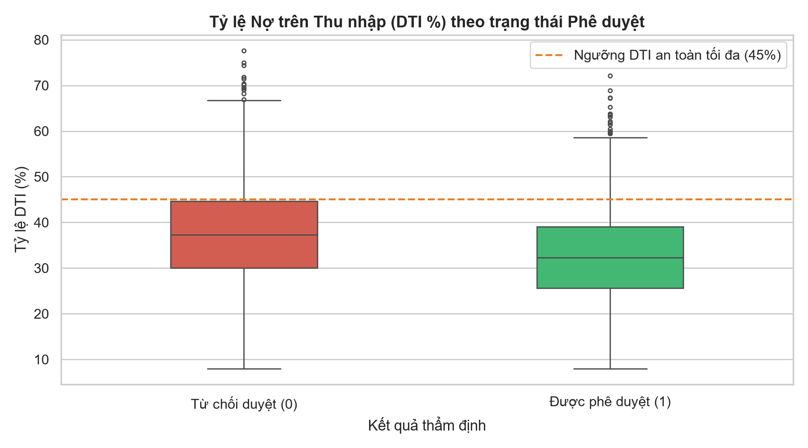

# BÁO CÁO KHÁM PHÁ DỮ LIỆU TÍN DỤNG VIỆT NAM (EDA SUMMARY REPORT)
## Dự án: Hệ thống Dự đoán Khả năng Phê duyệt Khoản vay

---

### 1. Tổng quan Bộ dữ liệu Khách hàng Việt Nam
- **Số lượng hồ sơ:** 6,000 khách hàng cá nhân
- **Số lượng thuộc tính:** 22 cột (Mã hồ sơ, Họ tên tiếng Việt, 19 biến tài chính/nhân khẩu học, 1 nhãn mục tiêu)
- **Đơn vị tiền tệ:** Việt Nam Đồng (VNĐ)
- **Chuẩn đánh giá tín dụng:** Điểm tín dụng CIC & Phân nhóm nợ CIC (Nhóm 1 đến Nhóm 5)
- **Số bản ghi trùng lặp:** 0 bản ghi

### 2. Phân bố Nhãn mục tiêu (`phe_duyet_khoan_vay`)
- **Được phê duyệt (1):** 2,978 hồ sơ (49.63%)
- **Bị từ chối duyệt (0):** 3,022 hồ sơ (50.37%)
- **Đánh giá:** Dữ liệu có tỷ lệ cân bằng tự nhiên lý tưởng (~50% : 50%), phản ánh đúng môi trường thẩm định thực tế của ngân hàng bán lẻ Việt Nam.

---

### 3. Dữ liệu thiếu (Missing Values)
Bộ dữ liệu ghi nhận tình trạng thiếu thông tin thực tế ở 5 trường dữ liệu:
| Tên cột | Số giá trị thiếu | Tỷ lệ (%) | Phương án xử lý (Giai đoạn 2) |
| :--- | :--- | :--- | :--- |
| `gia_tri_tai_san_dam_bao_vnd` | 119 | 1.98% | Impute bằng Median theo nhóm thu nhập |
| `ty_le_dti` | 112 | 1.87% | Impute bằng Median |
| `diem_tin_dung_cic` | 77 | 1.28% | Impute bằng Median |
| `so_nguoi_phu_thuoc` | 79 | 1.32% | Impute bằng Mode theo tình trạng hôn nhân |
| `thu_nhap_nguoi_dong_vay_vnd` | 64 | 1.07% | Impute bằng 0 (nếu độc thân) hoặc median |

---

### 4. Tương quan với Quyết định Phê duyệt Khoản vay
| Thuộc tính | Hệ số tương quan r | Ý nghĩa nghiệp vụ tín dụng Việt Nam |
| :--- | :--- | :--- |
| `diem_tin_dung_cic` | 0.487 | Điểm CIC cao chứng minh lịch sử thanh toán tốt, tỷ lệ duyệt cao |
| `so_lan_tre_han_2_nam` | -0.391 | Lịch sử chậm trả nợ khiến ngân hàng đánh tụt hạng tín nhiệm |
| `ty_le_dti` | -0.231 | DTI vượt mức an toàn (>45%) làm tăng nguy cơ quá tải tài chính |
| `so_tien_vay_vnd` | -0.266 | Số tiền vay quá lớn so với thu nhập và tài sản đảm bảo sẽ khó duyệt |

---

### 5. Phát hiện Ngoại lai & Chiến lược Tiền xử lý
- Thu nhập và khoản vay có độ lệch phải (right-skewed) với tỷ lệ ngoại lai ~3-4% (các khách hàng thu nhập cao hoặc vay mua bất động sản lớn).
- Áp dụng **Winsorization (Capping 1% - 99%)** và **RobustScaler** trong pipeline tiền xử lý để bảo vệ tính ổn định của mô hình.
