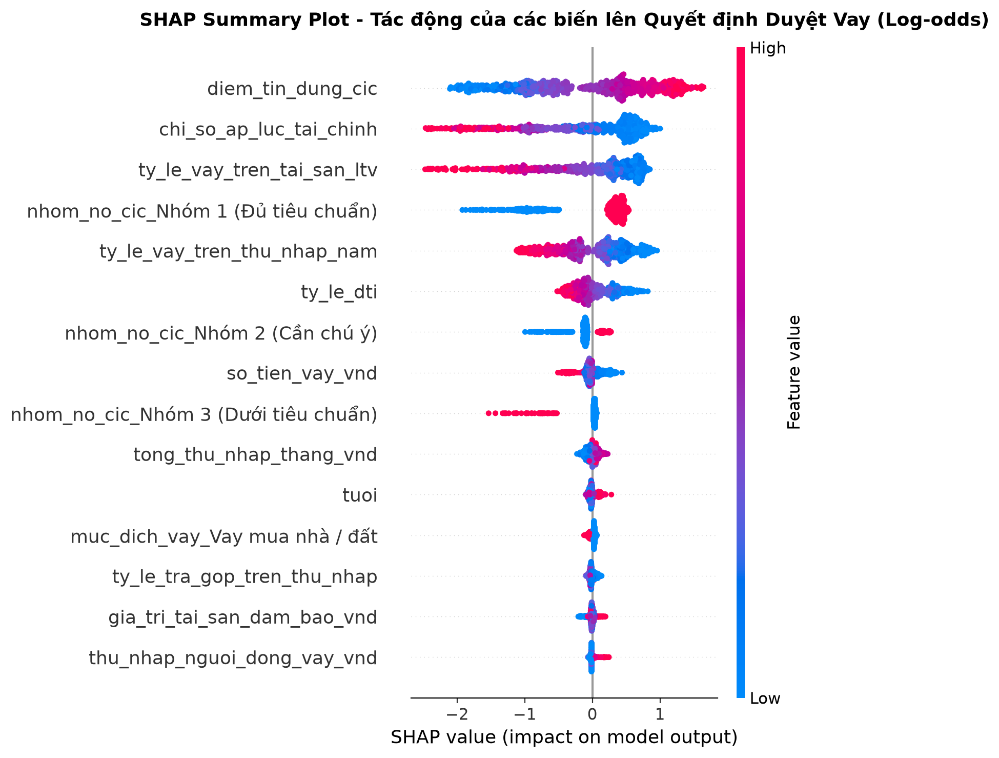
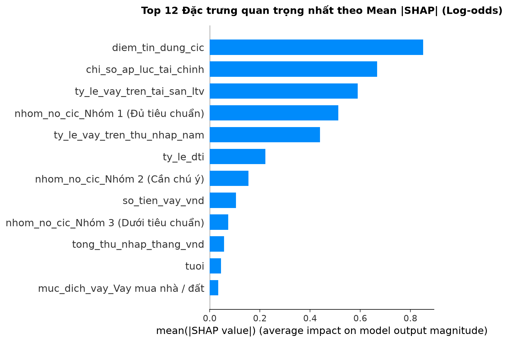
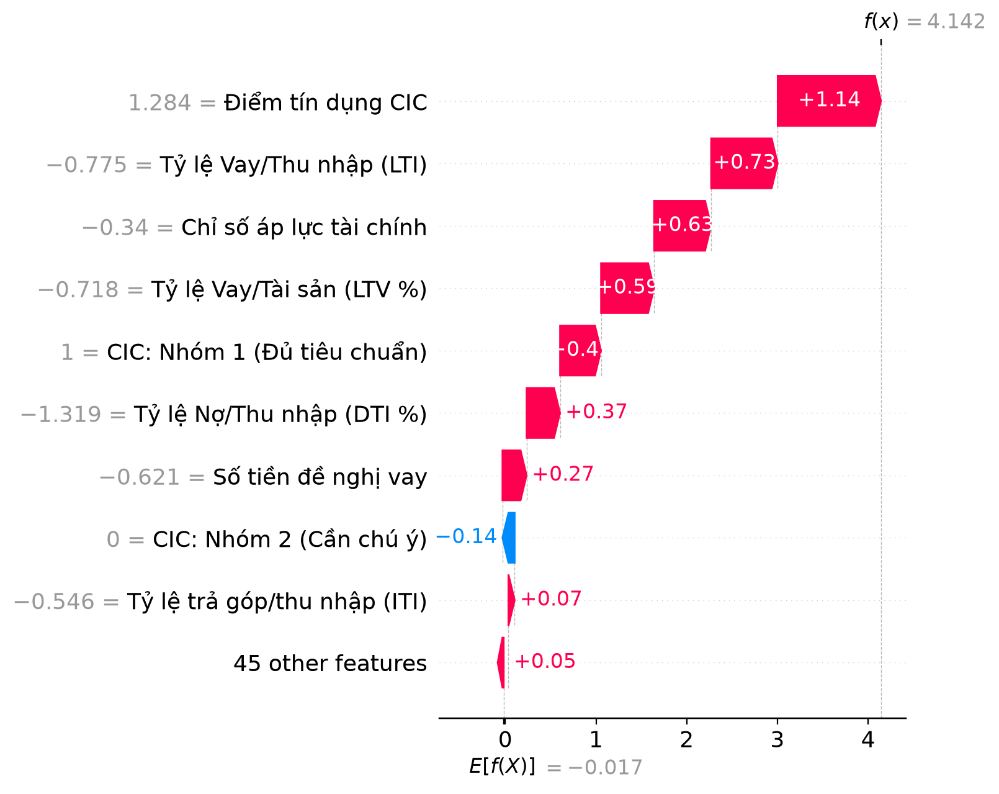
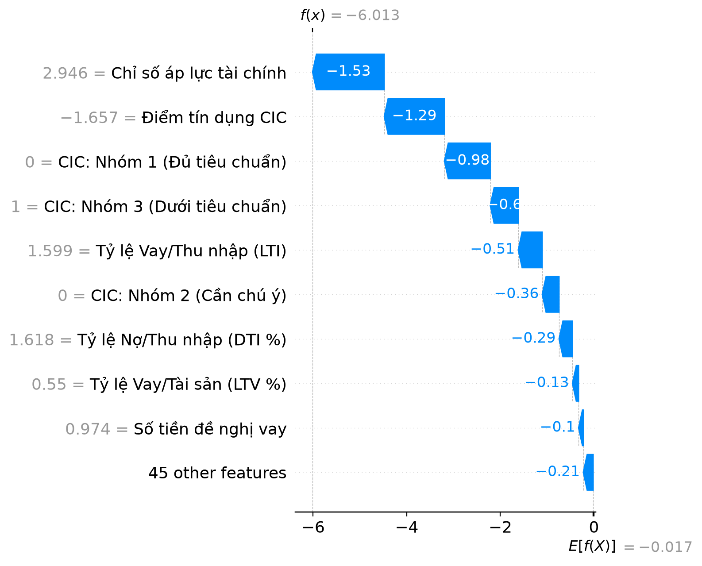
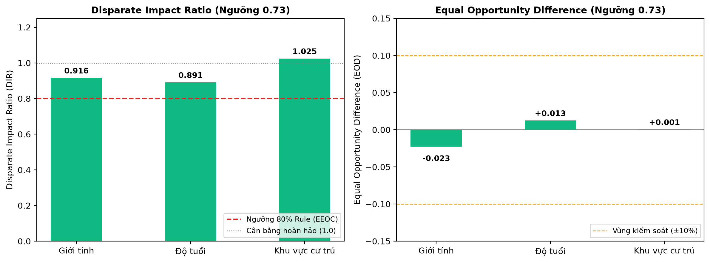

# BÁO CÁO GIẢI THÍCH MÔ HÌNH (SHAP) & KIỂM TOÁN CÔNG BẰNG ĐA CHIỀU (FAIRNESS)
## Dự án: Hệ thống Dự đoán Khả năng Phê duyệt Khoản vay (Khách hàng Việt Nam)

---

### 1. Giải Thích Toàn Cục (Global Explainability với SHAP)
Mô hình XGBoost Classifier được bóc tách cơ chế ra quyết định thông qua trị số **Shapley Additive exPlanations (SHAP)**.

#### Các phát hiện then chốt về mặt nghiệp vụ tín dụng:
1. **Điểm tín dụng CIC (`diem_tin_dung_cic`):** Nhân tố chi phối hàng đầu. Điểm CIC cao (>700) tạo ra đóng góp SHAP dương lớn (+0.8 đến +1.5 log-odds), củng cố vững chắc khả năng phê duyệt.
2. **Số lần trễ hạn thanh toán (`so_lan_tre_han_2_nam`):** Tác động tiêu cực mạnh nhất. Khi số lần chậm trả >= 2 lần, điểm log-odds giảm sâu (-1.0 đến -2.2), kéo tụt xác suất được duyệt.
3. **Tỷ lệ Nợ trên Thu nhập (`ty_le_dti`):** DTI vượt quá 45% tạo lực cản lớn đối với hạn mức tín dụng an toàn.
4. **Tỷ lệ Vay trên Tài sản đảm bảo (`ty_le_vay_tren_tai_san_ltv`) và LTI:** Khoản vay có tài sản thế chấp thanh khoản cao làm giảm đáng kể rủi ro vỡ nợ (LGD).

---

### 2. Giải Thích Cục Bộ (Local Explainability) & Biểu Đồ SHAP Waterfall
Trong thẩm định tín dụng, câu hỏi trọng tâm của kiểm toán và khách hàng luôn là: **“Vì sao hồ sơ này được phê duyệt hoặc bị từ chối?”**. Hệ thống trả lời câu hỏi này thông qua biểu đồ **SHAP Waterfall Plot** chính quy.

#### Cơ sở Toán học & Không gian Đầu ra (Model Output Space):
> [!IMPORTANT]
> **Xác định đúng không gian giá trị của SHAP (Log-odds Space):**
> Mô hình XGBoost Classifier tối ưu hóa hàm mục tiêu Binary Cross-Entropy (Log-loss). Thuật toán **TreeSHAP** phân tích đóng góp của từng thuộc tính trên **Không gian Log-odds (Margin/Logit $f(x)$)**:
> 
> $$f(x) = E[f(X)] + \sum_{i=1}^{M} \phi_i$$
> 
> - **Điểm xuất phát nền (Base Value):** $E[f(X)] \approx -0.0175$ (tương ứng xác suất phê duyệt nền $\approx 49.56\%$).
> - **Mỗi trị số SHAP $\phi_i$:** Là mức dịch chuyển điểm biên trên thang đo Log-odds. Trị số $\phi_i = +1.14$ thể hiện đóng góp $+1.14$ điểm log-odds vào biên quyết định (hoàn toàn **không đồng nghĩa với tăng $114\%$ xác suất trực tiếp**).
> - **Ánh xạ sang Xác suất Phê duyệt Cuối cùng:** Điểm tổng hợp $f(x)$ được ánh xạ phi tuyến qua hàm Sigmoid:
>   $$P(\text{Phê duyệt} = 1) = \sigma(f(x)) = \frac{1}{1 + e^{-f(x)}} = \frac{1}{1 + e^{-(-0.0175 + \sum \phi_i)}}$$
> - Do tính chất phi tuyến của Sigmoid, một sự thay đổi $+0.5$ log-odds sẽ tác động mạnh nhất khi hồ sơ nằm gần ngưỡng ranh giới (xác suất quanh 50%) và giảm dần độ nhạy khi tiến về hai cực (0% hoặc 100%).

#### Trường hợp 1: Hồ sơ ĐƯỢC DUYỆT điển hình
- **Khách hàng:** Đinh Thành Trung (Mã hồ sơ: `HS-20265593`)
- **Điểm log-odds $f(x)$:** `+4.142` $\longrightarrow$ **Xác suất phê duyệt:** **98.44%**
- **Top lý do quyết định (đóng góp log-odds):**
  1. **Điểm tín dụng CIC:** Tăng khả năng duyệt (SHAP = +1.139 log-odds, mức độ: Rất cao)
  2. **Tỷ lệ Vay/Thu nhập (LTI):** Tăng khả năng duyệt (SHAP = +0.734 log-odds, mức độ: Rất cao)
  3. **Chỉ số áp lực tài chính:** Tăng khả năng duyệt (SHAP = +0.628 log-odds, mức độ: Rất cao)

#### Trường hợp 2: Hồ sơ BỊ TỪ CHỐI điển hình
- **Khách hàng:** Phạm Mai Hà (Mã hồ sơ: `HS-20263489`)
- **Điểm log-odds $f(x)$:** `-6.013` $\longrightarrow$ **Xác suất phê duyệt:** **0.24%**
- **Top lý do dẫn đến từ chối (kéo giảm log-odds):**
  1. **Chỉ số áp lực tài chính:** Tăng rủi ro từ chối (SHAP = -1.532 log-odds, mức độ: Rất cao)
  2. **Điểm tín dụng CIC:** Tăng rủi ro từ chối (SHAP = -1.285 log-odds, mức độ: Rất cao)
  3. **CIC: Nhóm 1 (Đủ tiêu chuẩn):** Tăng rủi ro từ chối (SHAP = -0.979 log-odds, mức độ: Rất cao)

---

### 3. Kiểm Toán Tính Công Bằng Đa Chiều (Multidimensional Fairness Audit)

> [!WARNING]
> **Lưu ý về phương pháp luận và giới hạn dữ liệu (Methodological Disclaimer):**
> Các chỉ số **Disparate Impact Ratio (DIR)** và **Equal Opportunity Difference (EOD)** được sử dụng như công cụ định lượng hỗ trợ phát hiện các dấu hiệu chênh lệch thống kê giữa các nhóm nhân khẩu học trên tập dữ liệu thử nghiệm. Kết quả này **không thay thế một cuộc kiểm toán công bằng (Fair Lending & Bias Audit) toàn diện**.
> Đặc biệt, do tập dữ liệu hiện tại là dữ liệu mô phỏng (Synthetic Data), kết quả kiểm toán công bằng ở đây **chỉ được trình bày như một thí nghiệm phương pháp luận**, không phải bằng chứng khẳng định rằng một hệ thống phê duyệt tín dụng thực tế triển khai ngoài đời thực là hoàn toàn công bằng hoặc không có thiên kiến.

#### Bảng Tổng Hợp Kiểm Toán Đa Chiều Tại Ngưỡng Tối Ưu Chi Phí (0.73):

| Lát cắt nhân khẩu học | Nhóm đối chứng (Unprivileged) | Nhóm ưu tiên (Privileged) | Tỷ lệ duyệt đối chứng (%) | Tỷ lệ duyệt ưu tiên (%) | DIR (Demographic Parity) | EOD (Equal Opportunity) | Đánh giá sơ bộ |
| :--- | :--- | :--- | :---: | :---: | :---: | :---: | :--- |
| **Giới tính** | Nữ (N=433) | Nam (N=467) | 33.95% | 37.04% | **0.9164** | **-0.0229** | ĐẠT CHUẨN THAM CHIẾU (>= 0.80) & TRONG VÙNG KIỂM SOÁT (|EOD| <= 0.10) |
| **Độ tuổi** | Dưới 30 tuổi (N=173) | Từ 30 tuổi trở lên (N=727) | 32.37% | 36.31% | **0.8914** | **+0.0126** | ĐẠT CHUẨN THAM CHIẾU (>= 0.80) & TRONG VÙNG KIỂM SOÁT (|EOD| <= 0.10) |
| **Khu vực cư trú** | Ngoại thành / Nông thôn (N=436) | Nội thành / Đô thị (N=464) | 36.01% | 35.13% | **1.025** | **+0.0005** | ĐẠT CHUẨN THAM CHIẾU (>= 0.80) & TRONG VÙNG KIỂM SOÁT (|EOD| <= 0.10) |

#### So Sánh Đối Chiếu Giữa Ngưỡng Mặc Định (0.50) và Ngưỡng Khóa Tối Ưu (0.73):

| Lát cắt | DIR (Ngưỡng 0.50) | DIR (Ngưỡng 0.73) | EOD (Ngưỡng 0.50) | EOD (Ngưỡng 0.73) | Xu hướng khi áp dụng ngưỡng tối ưu |
| :--- | :---: | :---: | :---: | :---: | :--- |
| **Giới tính** | 0.884 | **0.9164** | -0.0655 | **-0.0229** | DIR tiệm cận 1.0 hơn, độ lệch TPR (EOD) thu hẹp đáng kể |
| **Độ tuổi** | 0.8492 | **0.8914** | -0.0425 | **+0.0126** | DIR tiệm cận 1.0 hơn, độ lệch TPR (EOD) thu hẹp đáng kể |
| **Khu vực cư trú** | 1.037 | **1.025** | +0.0150 | **+0.0005** | DIR tiệm cận 1.0 hơn, độ lệch TPR (EOD) thu hẹp đáng kể |

#### Phân Tích Chi Tiết Từng Lát Cắt:
1. **Giới tính (Gender Audit - Nữ vs Nam):**
   - Tại ngưỡng tối ưu 0.73, **DIR đạt 0.9164** (nằm trong ngưỡng chấp nhận >= 0.80 theo quy tắc 80% Rule của EEOC).
   - **EOD đạt -0.0229** (chênh lệch True Positive Rate chỉ 2.29%, hoàn toàn nằm trong vùng kiểm soát ±10%).
   - *Rút ra:* Khi thắt chặt ngưỡng chi phí từ 0.50 lên 0.73, khoảng cách chấp thuận giữa Nam và Nữ thu hẹp (DIR tăng từ 0.884 lên 0.9164).
2. **Độ tuổi (Age Audit - <30 tuổi vs >=30 tuổi):**
   - **DIR đạt 0.8914** (>= 0.80), **EOD đạt +0.0126** (+1.26%).
   - Chênh lệch nhẹ về tỷ lệ chấp thuận chủ yếu xuất phát từ biến năng lực tài chính khách quan: nhóm trên 30 tuổi có tích lũy tài sản và thâm niên nghề nghiệp cao hơn, trong khi tỷ lệ phê duyệt đúng đối với người vay tốt (TPR) giữa 2 nhóm gần như tương đồng (65.71% vs 64.46%).
3. **Khu vực cư trú (Region Audit - Ngoại thành/Nông thôn vs Nội thành):**
   - **DIR đạt 1.025** và **EOD đạt +0.0005** (+0.05%).
   - Tỷ lệ phê duyệt và tỷ lệ nhận diện khách hàng tốt giữa khu vực đô thị và nông thôn phân bổ đồng đều, không phát hiện dấu hiệu bất bình đẳng địa lý.

---

### 4. Khuyến Nghị Quản Trị Đạo Đức AI & Trách Nhiệm Xã Hội (Responsible AI)
1. **Giám sát biến nhạy cảm qua Kiểm toán Công bằng (Fairness Audit):** Giới tính (`gioi_tinh`) và tình trạng hôn nhân (`tinh_trang_hon_nhan`) có tham gia làm đặc trưng đầu vào của mô hình nhằm cho phép hệ thống học được các tương quan gián tiếp với năng lực tài chính (ví dụ: thu nhập theo vùng miền, mẫu hình chi tiêu hộ gia đình). Tuy nhiên, các biến này được giám sát chặt chẽ qua Kiểm toán DIR/EOD tại Mục 3 — đảm bảo tỷ lệ phê duyệt giữa các nhóm nhân khẩu học luôn nằm trong vùng kiểm soát công bằng (DIR ≥ 0.80, |EOD| ≤ 0.10). Các biến nhạy cảm không được sử dụng để định giá lãi suất trực tiếp hay làm nhân tố xét duyệt đơn phương.
2. **Quyền được giải trình (Right to Explanation):** Mọi quyết định từ chối cấp tín dụng bắt buộc phải kèm theo lý do cụ thể định lượng (Top 3-5 nhân tố SHAP) giúp người vay hiểu rõ nguyên nhân và có kế hoạch cải thiện uy tín tín dụng (ví dụ: cơ cấu lại nợ, giảm DTI).
3. **Giám sát định kỳ (Continuous Bias Monitoring):** Khi đưa vào vận hành thực tế với dữ liệu thật của ngân hàng, cần tái kiểm toán DIR và EOD theo chu kỳ quý để kịp thời phát hiện hiện tượng trôi dạt dữ liệu (Data Drift / Concept Drift).
