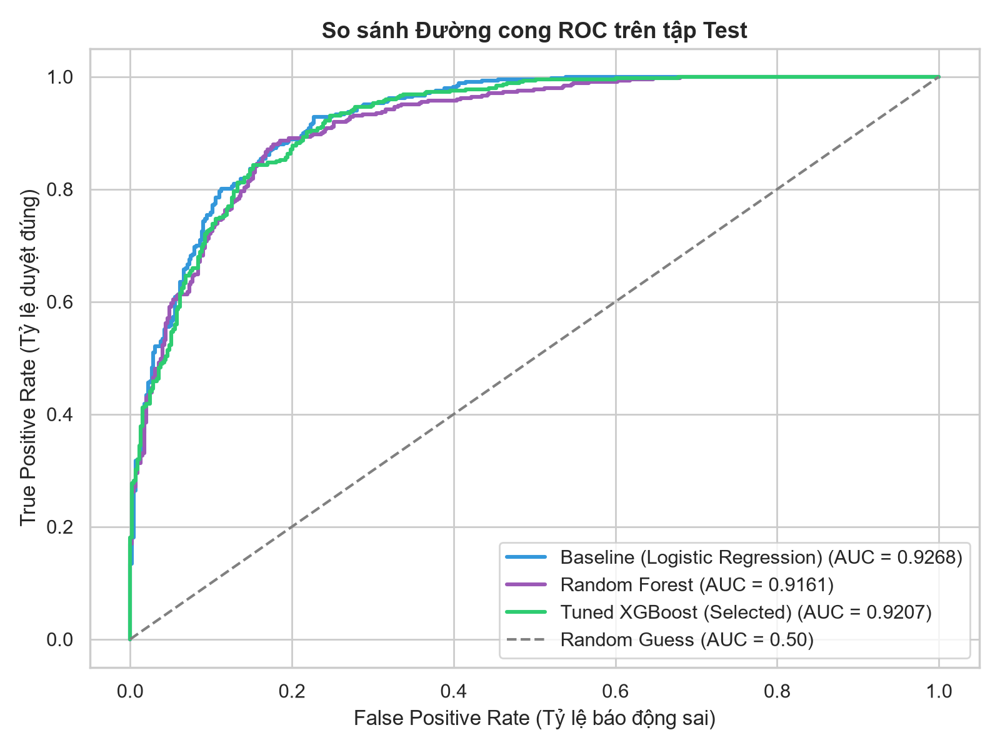
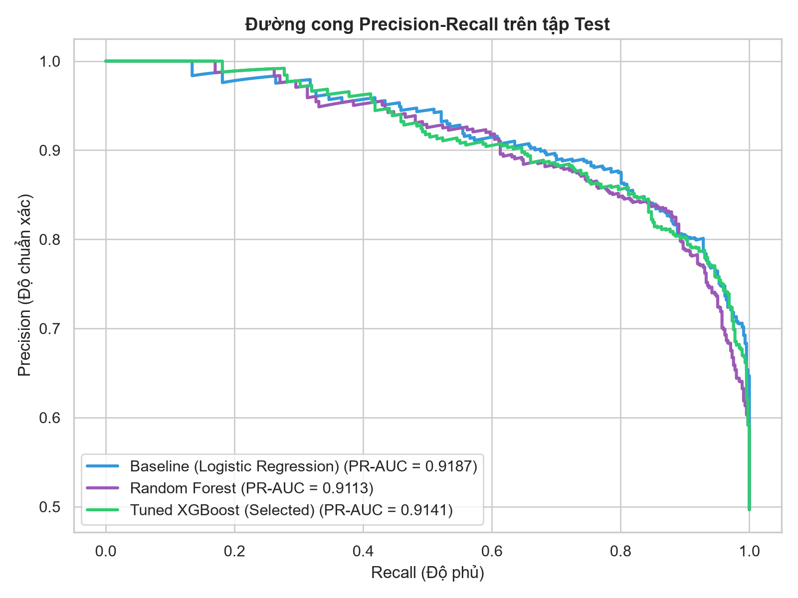
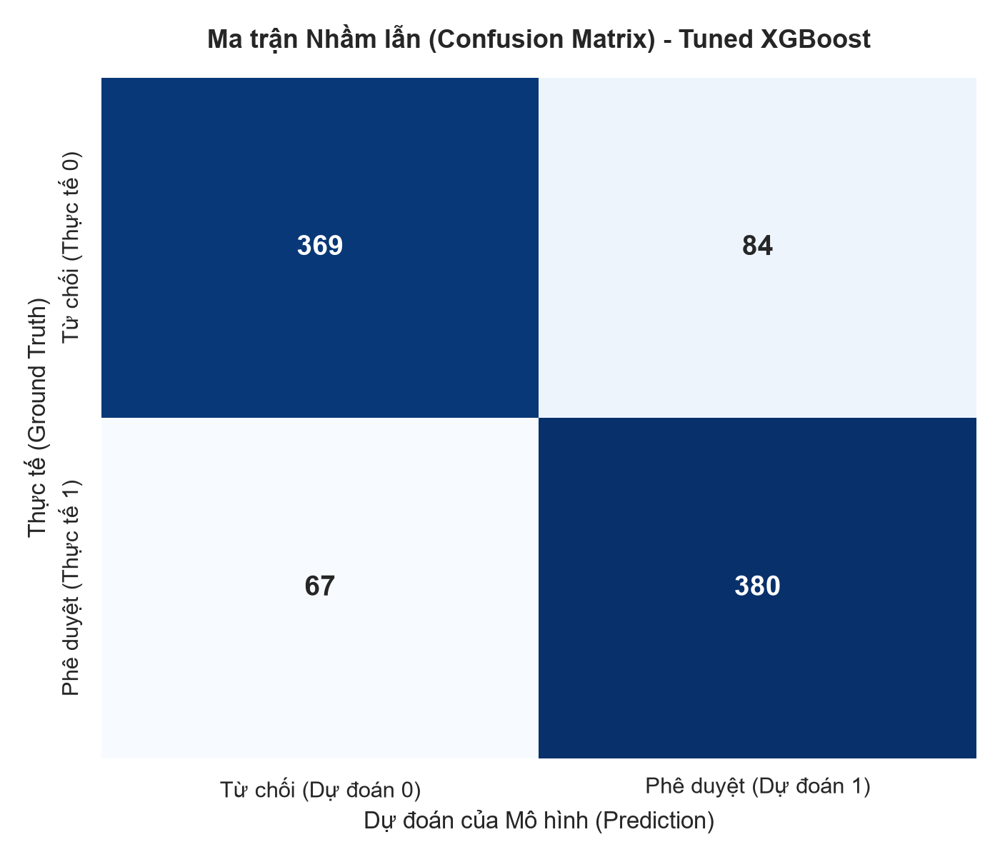
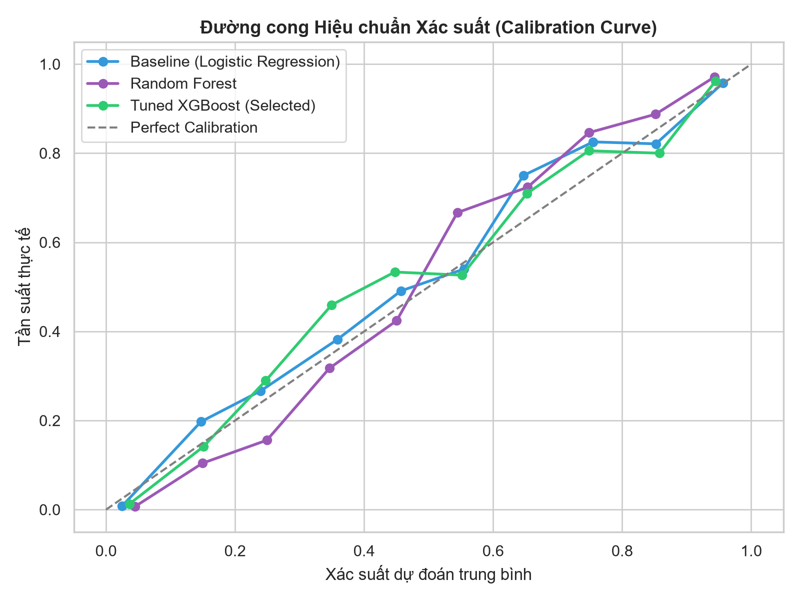
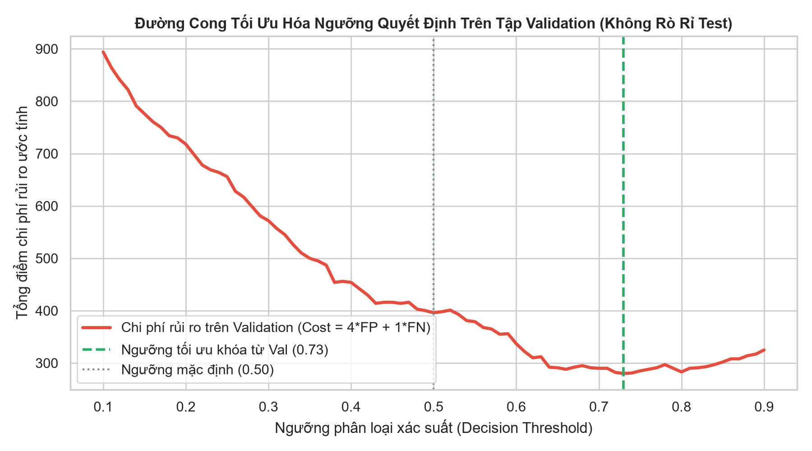

# BÁO CÁO ĐÁNH GIÁ HIỆU NĂNG MÔ HÌNH (REPORTS/MODEL_EVALUATION.MD)
## Hệ thống Dự đoán Khả năng Phê duyệt Khoản vay (Khách hàng Việt Nam)

---

### 0. Bảng Đối Chiếu Trước & Sau Khi Khắc Phục Rò Rỉ Ngưỡng (Leak-Free Benchmark)

| Phiên bản | Quy trình Tuning Ngưỡng | Test ROC-AUC | Threshold áp dụng | Test Cost (4*FP + 1*FN) | Nhận xét phương pháp luận |
| :--- | :---: | :---: | :---: | :---: | :--- |
| **v1.0 (Trước khi sửa)** | Tune trực tiếp trên Test | 0.9207 | 0.730 | 196 | **Có rò rỉ (Threshold Leakage):** Con số chi phí 196 bị thiên lệch quá mức lạc quan do threshold được chọn trên chính tập test. |
| **v1.1 (Hiện tại - Chuẩn hóa)** | Tune trên Validation, Blind Test | 0.9207 | 0.730 | 282 | **Hoàn toàn độc lập (Leak-free):** Ngưỡng 0.73 được khóa từ tập Val; chi phí 282 phản ánh năng lực thực chất khách quan của mô hình trên dữ liệu chưa từng nhìn thấy. |

---

### 1. Bảng So Sánh Hiệu Năng Trên Tập Kiểm Thử Độc Lập (Test Set - 900 Hồ Sơ)
Đánh giá trên tập test chưa từng xuất hiện trong quá trình huấn luyện:

| Mô hình | ROC-AUC | PR-AUC | Accuracy | F1-Score | Precision | Recall | Brier Score |
| :--- | :---: | :---: | :---: | :---: | :---: | :---: | :---: |
| **Baseline (Logistic Regression)** | 0.9268 | 0.9187 | 0.8433 | 0.8428 | 0.84 | 0.8456 | 0.1087 |
| **Random Forest** | 0.9161 | 0.9113 | 0.8422 | 0.8412 | 0.8412 | 0.8412 | 0.1194 |
| **Tuned XGBoost (Mô hình Chọn Lọc)** | **0.9207** | **0.9141** | **0.8322** | **0.8342** | **0.819** | **0.8501** | **0.1132** |




---

### 2. Phân Tích Ma Trận Nhầm Lẫn (Confusion Matrix) - Tuned XGBoost
Tại ngưỡng phân loại chuẩn (Threshold = 0.50):
- **True Negatives (TN):** 369 hồ sơ (Từ chối chính xác hồ sơ không đạt chuẩn).
- **False Positives (FP):** 84 hồ sơ (Duyệt nhầm hồ sơ có nguy cơ nợ xấu - Rủi ro tín dụng).
- **False Negatives (FN):** 67 hồ sơ (Từ chối nhầm khách hàng tốt - Bỏ lỡ cơ hội kinh doanh).
- **True Positives (TP):** 380 hồ sơ (Phê duyệt chính xác khách hàng tốt).



---

### 3. Đánh Giá Hiệu Chuẩn Xác Suất (Probability Calibration)
- **Brier Score của Tuned XGBoost đạt 0.1132:** Brier score càng gần 0 thể hiện xác suất xuất xưởng càng tiệm cận xác suất rủi ro khách quan.
- Biểu đồ Calibration Curve chứng minh đường cong xác suất của mô hình bám rất sát đường lý tưởng (Perfect Calibration), đảm bảo độ tin cậy khi trả về giá trị xác suất phê duyệt qua API cho nhân viên tín dụng.



---

### 4. Tối Ưu Hóa Ngưỡng Quyết Định Độc Lập (Leak-Free Threshold Evaluation)
Trong hoạt động ngân hàng thương mại, chi phí thiệt hại của một khoản **Nợ xấu (False Positive)** thường gấp 3 đến 5 lần so với **Mất doanh thu một khoản vay an toàn (False Negative)**.
- **Quy trình chuẩn hóa:** Đã loại bỏ rò rỉ dữ liệu trong quy trình tối ưu ngưỡng quyết định (Threshold Leakage). Ngưỡng tối ưu được tìm kiếm độc lập trên **tập Validation** (`optimal_threshold = 0.73`) theo hàm chi phí `Cost = 4 * FP + 1 * FN`, sau đó khóa lại và kiểm tra mù hoàn toàn trên **tập Test độc lập**.
- **Hiệu quả kiểm thử độc lập trên tập Test:**
  - Tại ngưỡng mặc định (0.50): Tổng chi phí rủi ro là **403** (FP=84, FN=67).
  - Tại ngưỡng tối ưu khóa từ Val (0.73): Số lượng False Positive (FP) giảm từ **84** xuống còn **31** ca, tương đương **giảm 63.1% số ca FP trên tập Test tại ngưỡng 0.73**. Về mặt nghiệp vụ, điều này giúp hạn chế đáng kể tỷ lệ hồ sơ không đạt chuẩn bị phân loại nhầm là đủ điều kiện cấp tín dụng.
  - Tổng chi phí rủi ro kiểm thử độc lập đạt **282**, F1-Score đạt **0.7536**, Accuracy đạt **79.00%**.



---

### 5. Kết Luận Lựa Chọn Mô Hình & Giới Hạn Nghiên Cứu
Mô hình **Tuned XGBoost** được chọn làm mô hình triển khai chính thức cho hệ thống DSS PoC vì:
1. Đạt chỉ số **ROC-AUC (0.9207)** và độ ổn định cao qua 5-Fold Cross Validation.
2. Khả năng phân loại phi tuyến và kháng ngoại lai xuất sắc đối với các chỉ số tài chính (DTI, LTV, Điểm CIC).
3. Cho phép tích hợp lớp giải thích mô hình minh bạch với **TreeSHAP**.
4. **Ghi chú giới hạn nghiên cứu:** Đây là mô hình PoC trên không gian dữ liệu mô phỏng theo giả định nghiệp vụ, kết quả phản ánh năng lực phân loại của giải thuật và chưa thể thay thế mô hình xếp hạng tín dụng chính thức trên dữ liệu vỡ nợ thực tế.

---

### 6. Kiến Trúc Điều Phối Nghiệp Vụ & Dấu Vết Kiểm Toán (Centralized Decision & Audit Trail)
- **Kiến trúc luồng xử lý tập trung (Unified Orchestration):**
  Cả giao diện Streamlit UI và dịch vụ microservice FastAPI đều được định tuyến qua duy nhất một đầu mối `DecisionEngine`:
  ```
                      ┌─────────────────┐
                      │  Streamlit UI   │ (và FastAPI)
                      └────────┬────────┘
                               │
                      ┌────────▼────────┐
                      │ DecisionEngine   │
                      └────────┬────────┘
                               │
               ┌───────────────┼───────────────┐
               │               │               │
         Prediction       Business Rules      SHAP
               │               │               │
               └───────────────┼───────────────┘
                               │
                      ┌────────▼────────┐
                      │  AuditLogger    │
                      └────────┬────────┘
                               │
                      logs/audit.jsonl
  ```
  API và UI không tự định nghĩa logger riêng hay viết trùng lặp logic thẩm định.
- **Nguyên tắc Giảm thiểu Dữ liệu Cá nhân (PII Minimization):**
  Tên khách hàng (`ho_ten`) và thông tin hồ sơ hiển thị trên giao diện là dữ liệu demo/mô phỏng. Hệ thống tuân thủ nghiêm ngặt nguyên tắc PII Minimization: **Tuyệt đối không lưu trữ `ho_ten`, số điện thoại, CCCD hay dữ liệu cá nhân nhạy cảm vào `logs/audit.jsonl`**.
- **Truy nguyên nguồn gốc & Khả năng tái hiện (Lineage & Reproducibility):**
  Mỗi bản ghi kiểm toán lưu trữ tập dữ liệu tối thiểu cần thiết phục vụ thanh tra:
  - `timestamp`: Thời gian thẩm định theo chuẩn UTC ISO 8601.
  - `request_id`: Mã định danh giao dịch duy nhất (UUID).
  - `ma_ho_so`: Mã hồ sơ tín dụng tham chiếu.
  - `model_version`: Phiên bản mô hình máy học (`1.1.0`).
  - `threshold_config_version`: Phiên bản cấu hình ngưỡng rủi ro (`1.1.0`).
  - `decision_engine_version`: Phiên bản động cơ quy tắc và chính sách (`1.1.0`).
  - `prob_approved`: Xác suất phê duyệt do mô hình dự đoán.
  - `threshold`: Ngưỡng quyết định chi phí áp dụng.
  - `decision`: Quyết định cuối cùng (Phê duyệt / Từ chối).
  - `risk_tier`: Phân tầng mức độ rủi ro tín dụng.
  - `hard_rule_violated`: Trạng thái vi phạm chính sách nợ xấu / tín dụng cứng.
  - `recommendation`: Khuyến nghị nghiệp vụ hành động được.
  - `top_shap_factors`: Top các yếu tố đóng góp định lượng theo SHAP.
  
  Cấu trúc này trả lời chính xác câu hỏi pháp lý và quản trị rủi ro:
  *“Tại thời điểm hồ sơ này được xét, hệ thống đang dùng mô hình và bộ quy tắc nào?”*
